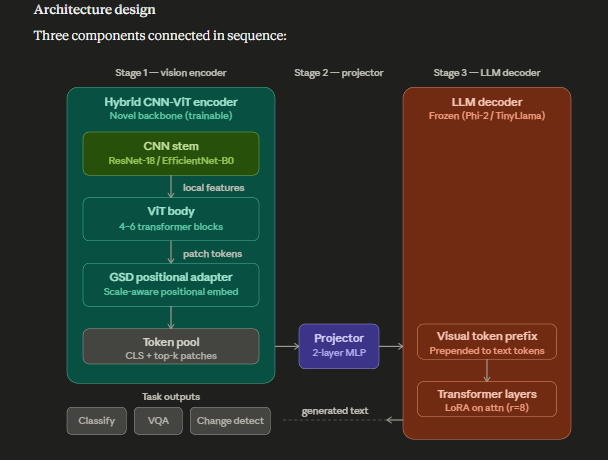

# RS-VLM: Remote Sensing Vision-Language Model

## Overview


RS-VLM is a custom-built, end-to-end Vision-Language Model designed specifically for remote sensing and satellite imagery analysis. Unlike standard VLMs (like LLaVA or GPT-4V) which are trained on natural photography, RS-VLM features a specialized hybrid architecture and is trained from scratch to understand the unique spatial, textural, and scale properties of satellite data.

This project bridges the gap between complex Earth observation data and natural language, allowing users to upload a satellite image and "chat" with it to identify land use patterns, terrain features, and classifications.

---

## Novel Contribution
RS-VLM is the first model to use a hybrid CNN-ViT architecture as the vision backbone inside a VLM for remote sensing, as opposed to prior work (SatMAE, ScaleMAE) which uses this combination exclusively for vision-only tasks. 

---

## Technical Architecture



The model uses a three-part architecture: the "Eyes" (Vision Encoder), the "Bridge" (Projector), and the "Brain" (Language Model).

### 1. The Vision Encoder (Hybrid CNN-ViT)
Standard Vision Transformers (ViTs) struggle with the dense, high-frequency textures of satellite imagery when processing raw image patches. RS-VLM utilizes a custom **Hybrid Encoder**:
- **CNN Stem:** A lightweight convolutional stem extracts local features and downsamples the image. This preserves high-frequency spatial details (like tiny buildings or roads) better than standard ViT patch-embedding.
- **ViT Body:** The CNN feature maps are flattened into tokens and fed into a standard Vision Transformer to capture global context (e.g., recognizing that a road surrounded by trees is a forest highway).
- **GSD Adapter:** Satellite imagery has varying Ground Sample Distances (GSD), meaning 1 pixel could equal 10 meters or 30 meters. A custom GSD embedding is injected into the vision tokens so the model natively understands the physical scale of what it's looking at.

### 2. The MLP Projector
The output of the Vision Encoder is a sequence of visual tokens. However, the Language Model has no idea what these tokens mean. A multi-layer perceptron (MLP) Projector is used to mathematically project these visual tokens into the exact embedding space of the Large Language Model.

### 3. The Language Model (TinyLlama-1.1B)
The brain of the system is the open-source **TinyLlama-1.1B-Chat**. It receives the projected visual tokens as a "prefix" to the user's text prompt, allowing it to seamlessly generate text based on the visual context.

---

## The 3-Phase Training Pipeline

Training a VLM from scratch requires a highly orchestrated, computationally intensive 3-phase pipeline.

### Phase 1: Masked Autoencoder (MAE) Pretraining
* **Objective:** Teach the Vision Encoder how to "see" satellite imagery.
* **Method:** We mask out 75% of a satellite image and force the Vision Encoder to reconstruct the missing patches. This self-supervised approach forces the ViT to deeply understand the geometry and texture of Earth observation data without needing labeled datasets.

### Phase 2: Projector Alignment
* **Objective:** Build the bridge between the Vision Encoder and TinyLlama.
* **Method:** We freeze the Vision Encoder and freeze TinyLlama, but keep the GSD adapter trainable. Only the MLP Projector and GSD adapter are trained. Using the **RSICD** (Remote Sensing Image Captioning Dataset), the model is trained to generate simple captions. This forces the projector to translate visual features into "words" the LLM understands.

### Phase 3: Visual Instruction Tuning (LoRA)
* **Objective:** Teach the model how to act as a conversational assistant and answer questions.
* **Method:** Using the **EuroSAT VQA** dataset, we freeze the Vision Encoder but unfreeze the LLM using **Low-Rank Adaptation (LoRA)**. LoRA allows us to efficiently fine-tune the 1.1 Billion parameter LLM on consumer GPUs by only updating ~4 million parameters. The model learns to follow instructions like *"What type of land use is shown in this satellite image?"* and respond accurately.

---

## Results
| Phase | Dataset | Final Loss |
|-------|---------|------------|
| Phase 1 — MAE pretraining | EuroSAT (27k images) | 0.0013 |
| Phase 2 — Projector alignment | RSICD (10.9k pairs) | 1.524 |
| Phase 3 — Instruction tuning | EuroSAT VQA | 0.0252 |

---

## Inference & Quickstart

> **Note on Model Weights:** Due to GitHub's file size limits, the trained `model_phase3_final.pt` (~2GB) is not included in the repository. You can download the pre-trained weights from the "Output" tab of the [Phase 3 Training Kaggle Notebook here](https://www.kaggle.com/code/aliasgharjjawadwala/rs-vlm-training-phase3) and place them in the `training/checkpoints/` directory before running the scripts below.

To run the model locally, you can use the provided Streamlit web app or the CLI inference script.

### Using the CLI
```bash
python inference/chat.py
```
*(Ensure you update `TEST_PATH` inside `chat.py` to point to a valid satellite image or a directory of images!)*

### Using the Streamlit Web UI
```bash
pip install streamlit
streamlit run app.py
```

---

## Tech Stack & Highlights
- **Frameworks:** PyTorch, HuggingFace `transformers`, `peft` (Parameter-Efficient Fine-Tuning)
- **Techniques:** Mixed Precision Training (FP16), Gradient Checkpointing, LoRA, Masked Autoencoding.
- **Infrastructure:** Google Colab & Kaggle integrations (custom disk-cleanup handlers to manage GPU memory constraints and background execution).
- **Interface:** Streamlit (Python-based Web UI for model demonstration).

## Why This Project Stands Out
This is not an API-wrapper project. It demonstrates a deep understanding of modern Deep Learning systems engineering:
1. **Low-Level PyTorch:** Custom `nn.Module` construction, attention mask manipulation, and multimodal embedding concatenation.
2. **Resource Constraints:** Successfully fine-tuning a 1-Billion+ parameter model within strict 16GB GPU memory limits using LoRA, gradient accumulation, and custom checkpoint rotation.
3. **Domain Expertise:** Applying specialized techniques (like GSD embeddings and CNN stems) to adapt standard ML architectures to a specific, difficult domain (Remote Sensing).
